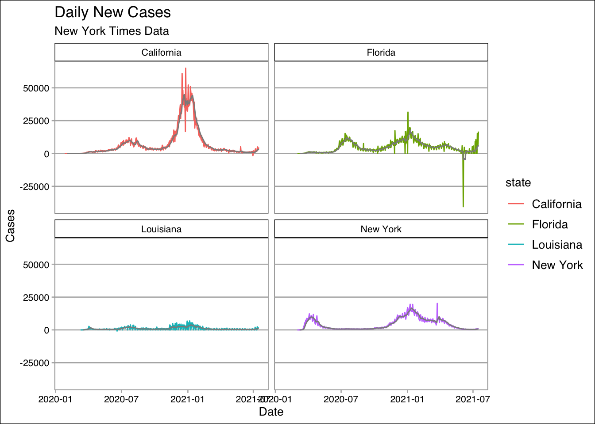
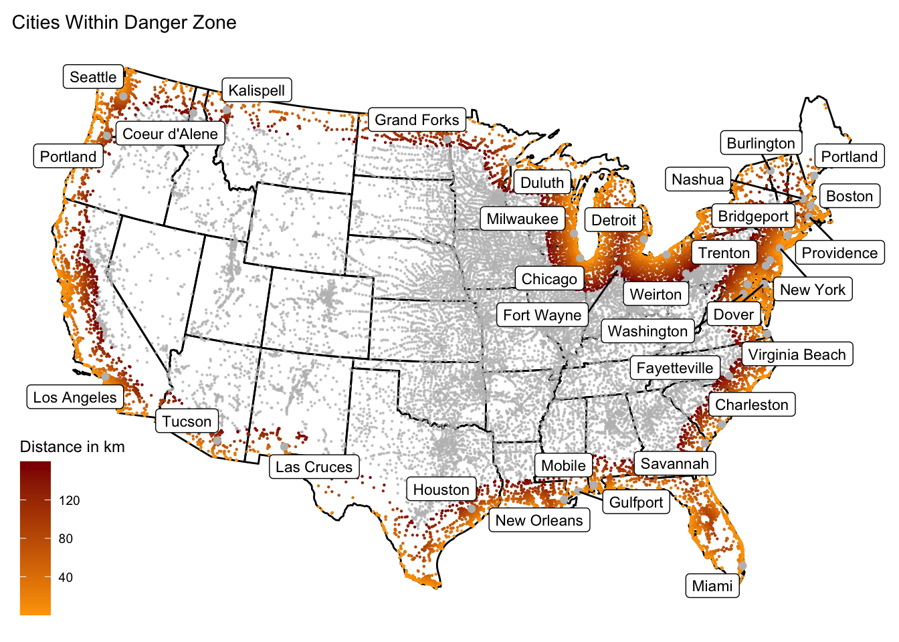
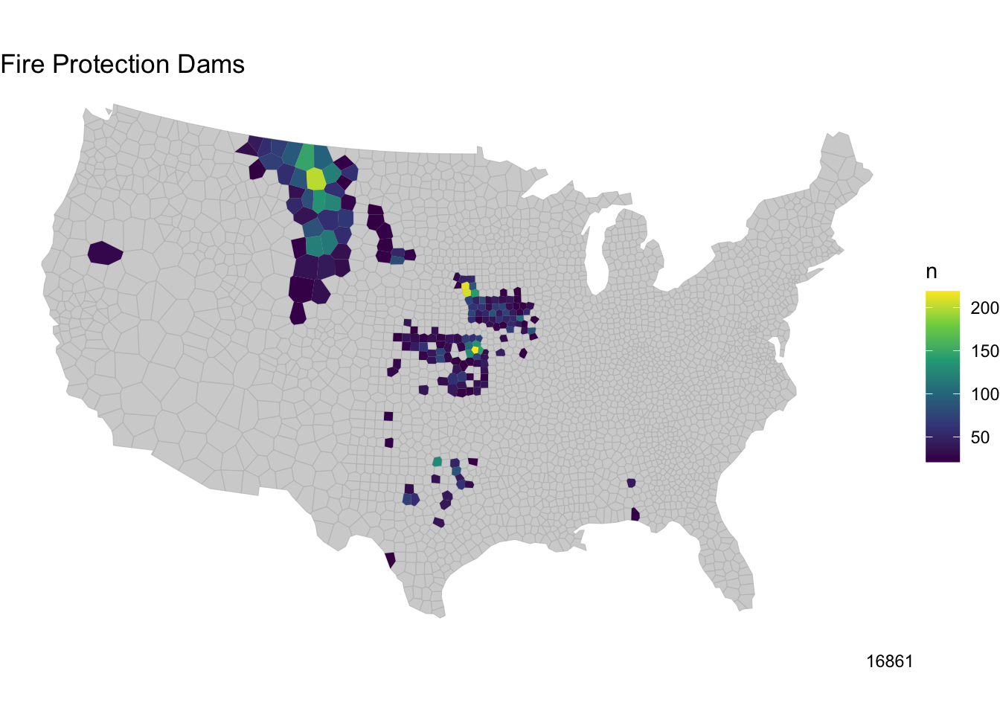

In the summer of 2021, I took a class called Intro to Programming for GIS, where I learned how to use R for spatial analysis. A collection of my projects can be found below.

## [Building a project website](index.html)

- In this assignment, I gained familiarity with R and RStudio.
- I also learned how to use RMarkdown to make a GitHub Pages website.
- The code for this project can be accessed in a GitHub repository.

## [COVID 19 Pandemic Analysis](geog-13-labs/lab-02.html)
{width=500px}

- I used New York Times COVID data to practice data wrangling and visualization.
- I determined which California counties had the worst outbreaks.
- I created faceted bar plots to visualize daily new cases in four states.

## [Understanding US Borders](geog-13-labs/lab-03.html)
{width=500px}

- In this assignment, I learned about the properties of simple feature objects.
- I continued to practice my data wrangling and visualization skills.
- I mapped cities that fall within 100 miles of US external borders.

## [US Dams and Tessellations](geog-13-labs/lab-04.html)
{width=500px}

- I learned about the challenges of the Modifiable Areal Unit Problem (MAUP).
- I utilized spatial joins and feature simplification.
- I created maps of various dams in the US and identified their purposes.
