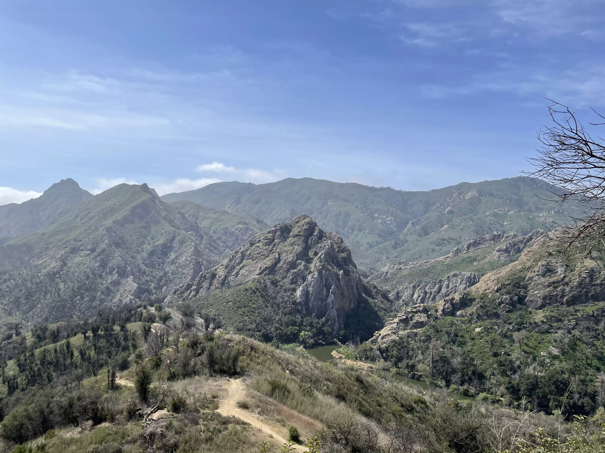

# Hi, I'm Hannah Malak.
<i class="fa fa-user-circle"></i> 

  
I am a second year undergraduate at the University of California, Santa Barbara, majoring in Geography with an emphasis in Geographic Information Science. I am interested in the ways that GIS and spatial analysis can be applied to the fields of public health and urban planning. In my free time, I enjoy roller skating, playing chess, and spending time outdoors.

